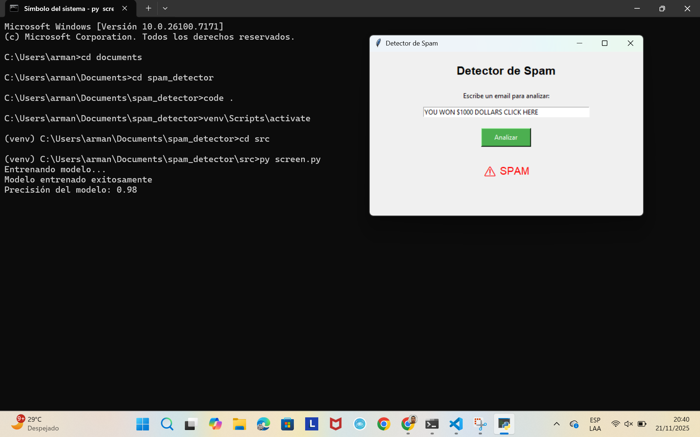
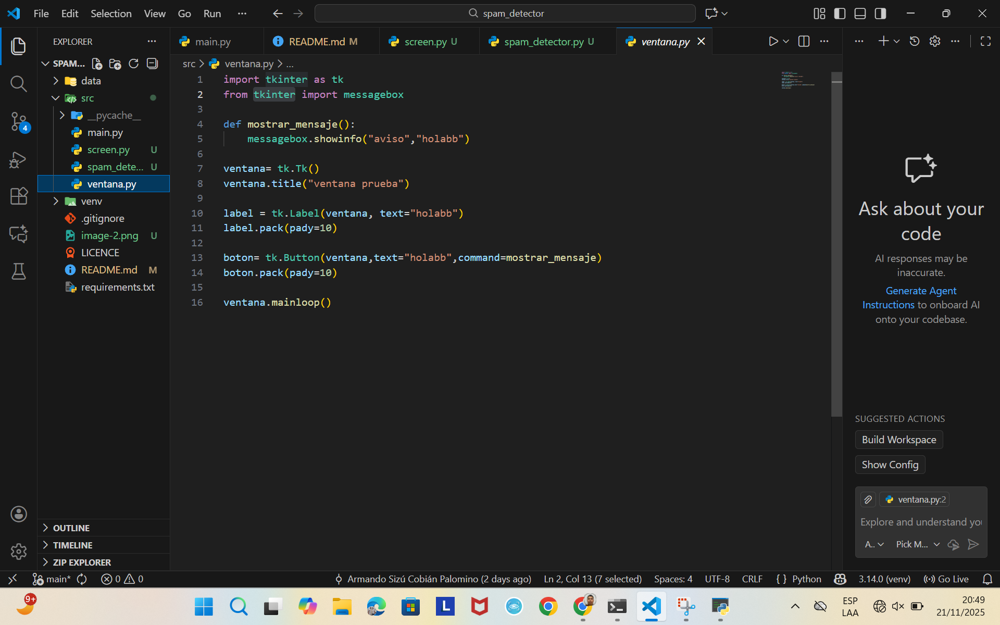
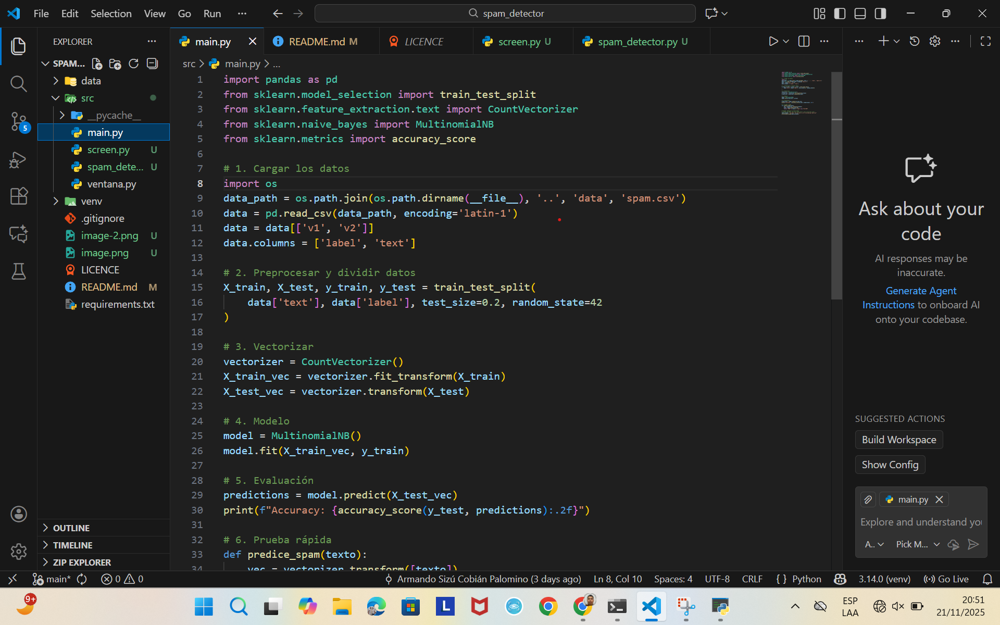

# Spam Detector (Práctica Fundamentos de Programación - IA)

## ¿De qué trata la práctica?
Esta práctica trata de un **detector de spam** hecho en Python.  
El programa entrena un modelo de IA con un dataset de correos y luego permite escribir un email para saber si es **SPAM o NO SPAM**.

## ¿Qué es y qué hace la práctica? / ¿Qué aprendimos?
La práctica es un proyecto de software con estructura profesional (src, data, venv).  
Aprendimos a:
- Crear proyectos organizados en Python.
- Usar entornos virtuales para aislar dependencias.
- Instalar librerías con pip y generar requirements.txt.
- Entrenar un modelo simple de Machine Learning (Naive Bayes).
- Vectorizar texto con CountVectorizer.
- Evaluar precisión del modelo.
- Crear una interfaz gráfica en Tkinter.
- Usar Git y GitHub para control de versiones.

## ¿Cómo?
1. Creamos una carpeta nueva para el proyecto.
2. Creamos el entorno virtual (venv).
3. Activamos el entorno virtual.
4. Instalamos librerías necesarias.
5. Creamos estructura del proyecto (src y data).
6. Agregamos archivos base (.gitignore, README, LICENSE).
7. Entrenamos y probamos el modelo.
8. Creamos interfaz gráfica con Tkinter.
9. Subimos a GitHub con Git.

## ¿Cómo lo hicimos? / Tecnologías-Librerías utilizadas
**Tecnologías**
- Python 3
- VS Code como IDE
- Git y GitHub

**Librerías**
- `pandas`: para leer y manejar el CSV.
- `numpy`: soporte numérico.
- `scikit-learn`: para Machine Learning:
  - `train_test_split` (dividir datos)
  - `CountVectorizer` (convertir texto a números)
  - `MultinomialNB` (modelo Naive Bayes)
  - `accuracy_score` (evaluación)
- `tkinter`: para crear la interfaz gráfica.

## Trabajo futuro (mejoras)
- Probar otros algoritmos de IA (por ejemplo SVM, Logistic Regression o modelos más avanzados).
- Entrenar más el modelo con más datos o limpieza de texto.
- Guardar el modelo entrenado en un archivo `.pkl` para no entrenar cada vez.
- Mejorar la interfaz (por ejemplo permitir pegar textos largos o mostrar porcentaje de confianza).

## Me dio error y así lo resolví
Algunos errores comunes en esta práctica y soluciones:

1. **Error al leer el CSV (UnicodeDecodeError)**  
   Se resolvió usando:
   `pd.read_csv(data_path, encoding='latin-1')`

2. **Error de ruta al archivo spam.csv (FileNotFoundError)**  
   Se resolvió creando la función `obtener_ruta_datos()` con `os.path.join`
   para asegurar que siempre encuentre el archivo dentro de `data/`.

3. **No encontraba librerías (ModuleNotFoundError)**  
   Se resolvió instalando en el entorno virtual:
   `pip install numpy pandas scikit-learn`

4. **Entorno virtual no activado**  
   Se resolvió activándolo con:
   `venv\Scripts\activate`
   y verificando que aparezca `(venv)` en la terminal.

(PD#2: El lenguaje de marcado Markdown (del README.md), admite hasta imágenes, por si quieren tratar de poner capturas para mejorar su documentación). 

